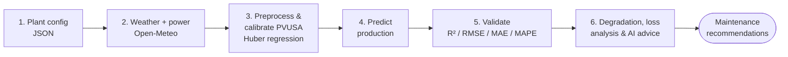

<div align="center">

# ☀️ SolarPro

**AI-powered decision support for photovoltaic performance — predict production, diagnose losses, and plan maintenance.**

[](LICENSE)
[](https://www.python.org/)
[-orange.svg)](https://lozanobosch.k3pler.org/)
[](https://lozanobosch.k3pler.org/)

🏆 **1st place out of 280 projects — 2026 Eiffage Eco Skills Challenge**

[Live demo](https://lozanobosch.k3pler.org/) · [How it works](#-how-it-works) · [Quickstart](#-quickstart) · [Architecture](docs/architecture.md)

</div>

---

## Overview

Most solar plant owners only discover a problem when a major fault appears. Yet
performance losses from dust, pollen, humidity and panel degradation can quietly
cut production for *months* without being visible.

**SolarPro** turns weather data and production history into actionable insight.
It predicts the production a healthy plant *should* deliver for the observed
weather, isolates the losses that weather alone cannot explain, models the
physical degradation mechanisms behind them, and produces plain-language
maintenance recommendations.

Unlike traditional monitoring dashboards that only visualize the past, SolarPro
focuses on **prediction and decision support** — helping users anticipate and
recover losses.

### What makes it different

- 🌐 **Runs entirely in the browser** via **PyScript + WebAssembly** — advanced
  Python computation client-side, zero installation, usable on a tablet on-site.
- 🔬 **Physics-grounded, not a black box** — the empirical **PVUSA** model plus
  **multi-physics degradation** (Arrhenius, Hallberg-Peck, HSU soiling).
- 🤖 **AI maintenance assistant** — an open-source LLM via **Ollama** translates
  the numerical diagnosis into prioritized actions.
- ♻️ **Decision support** — quantifies recoverable energy and CO₂ to prioritize
  interventions.

> The same dependency-light Python core runs **both** as an importable library
> (this repo, notebooks, tests) **and** in the browser via Pyodide — one codebase,
> two delivery modes.

## ✨ Features

| Capability | Module |
|---|---|
| Weather retrieval (Open-Meteo history + 15-day forecast) | [`weather.py`](src/solarpro/weather.py) |
| Preprocessing (wind correction, IQR/Hampel, operating-row filtering) | [`preprocessing.py`](src/solarpro/preprocessing.py) |
| Cell-temperature model (Skoplaki) | [`prediction/cell_temperature.py`](src/solarpro/prediction/cell_temperature.py) |
| PVUSA production model + robust (Huber) calibration | [`prediction/`](src/solarpro/prediction) |
| Degradation: Arrhenius / Hallberg-Peck / HSU → TDR | [`degradation/`](src/solarpro/degradation) |
| Validation metrics (R², RMSE, MAE, MAPE) | [`metrics.py`](src/solarpro/metrics.py) |
| Performance-loss & anomaly analysis | [`losses.py`](src/solarpro/losses.py) |
| AI maintenance recommendations (Ollama, graceful fallback) | [`recommendations.py`](src/solarpro/recommendations.py) |

## 🔄 How it works

SolarPro runs a six-stage pipeline:



1. **Configure** the installation (location, tilt, azimuth, installed kWc, panel specs).
2. **Retrieve** hourly weather — irradiance (GTI), temperature, wind, humidity, precipitation.
3. **Calibrate** PVUSA coefficients on *training data only* with robust **Huber regression**.
4. **Predict** the healthy production baseline across all periods.
5. **Validate** on a held-out test set (quality bar: **R² > 0.85**).
6. **Diagnose** — model degradation (TDR), flag anomalies, and generate recommendations.

See [`docs/methodology.md`](docs/methodology.md) for the model equations and references.

## 🧪 Sample results

Running the bundled demo (`python -m solarpro`) on the included **synthetic**
50 kWc plant — two years of hourly data with an injected 5-week string fault:

| Metric | Value |
|---|---|
| Test R² | **0.96** ✅ (clears the 0.85 bar) |
| Test MAPE | 4.2 % |
| Anomaly hours detected | 5.4 % (matches the injected fault window) |
| Recoverable energy flagged | ~1,390 kWh |

> At the competition, SolarPro was presented as avoiding **~825 kWh/year** of
> losses on a standard 50 kWc Eiffage installation. The bundled dataset here is
> **synthetic, for demonstration and reproducibility** — plug in your own
> Open-Meteo location and production history for real results.

## 🚀 Quickstart

```bash
# 1. Clone & install
git clone https://github.com/gaiaflaviamezaib/SolarPro.git
cd SolarPro
pip install -e .

# 2. Run the full pipeline on the bundled demo data
python -m solarpro                 # uses Ollama if running
python -m solarpro --no-ollama     # rule-based recommendations, fully offline
```

### AI recommendations (optional)

```bash
# Install Ollama (https://ollama.com) then pull an open model:
ollama pull llama3
# SolarPro auto-detects the local server; if absent it falls back to rules.
```

### Run the in-browser app

```bash
python -m http.server --directory web 8000
# open http://localhost:8000  → click "Run demo pipeline" (runs in WASM)
```

## 🗂️ Project structure

```
SolarPro/
├── src/solarpro/         # Pure-Python core (Pyodide-compatible)
│   ├── config.py         # Plant & model configuration
│   ├── weather.py        # Open-Meteo retrieval
│   ├── preprocessing.py  # Cleaning, filtering, train/test split
│   ├── prediction/       # Skoplaki cell temp, PVUSA, calibration
│   ├── degradation/      # Arrhenius, Hallberg-Peck, HSU, TDR
│   ├── losses.py         # Loss & anomaly analysis
│   ├── recommendations.py# Ollama maintenance advisor
│   └── pipeline.py       # Six-stage orchestration + CLI
├── web/                  # PyScript / WebAssembly front-end
├── data/sample/          # Synthetic demo dataset + plant config
├── notebooks/            # Calibration & loss-analysis walkthrough
├── tests/                # pytest suite
└── docs/                 # Architecture & methodology
```

## 💼 Product model (context)

SolarPro's pricing follows its architecture — *what is free to run is free to use;
what needs a server is paid*:

- **Solo** — free, local, single user.
- **Team** — cloud, includes the AI assistant; for operators of 5–50 plants.
- **Portfolio** — on-premise deployment with a dedicated SLA for large operators.

## 📚 References

- Dows & Gough (1995), *PVUSA Procurement, Acceptance and Rating Practices*.
- Skoplaki & Palyvos (2009), *Operating temperature of PV modules*, Renewable Energy.
- Hallberg & Peck (1991), *Recent Humidity Accelerations*, QREI.
- Coello & Boyle (2019), *Simple Model for Predicting Time Series Soiling*, IEEE J. Photovoltaics.
- Jordan & Kurtz (2013), *Photovoltaic Degradation Rates — An Analytical Review*, Prog. Photovoltaics.
- Weather data: [Open-Meteo](https://open-meteo.com/).

## 🛠️ Development

```bash
pip install -e ".[dev]"
pytest
ruff check .
```

## 📄 License

[MIT](LICENSE) © 2026 Gaïa Mezaïb

<div align="center">
<sub>Built for the 2026 Eiffage Eco Skills Challenge · <a href="https://lozanobosch.k3pler.org/">live demo</a></sub>
</div>
