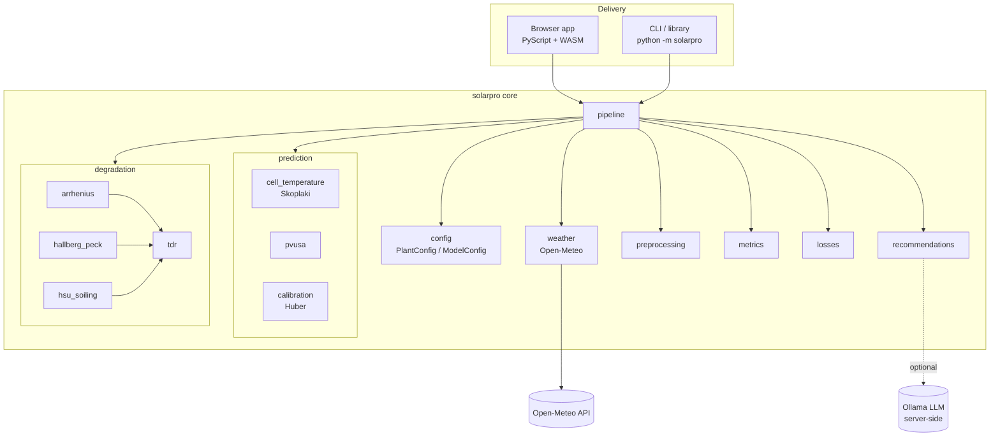

# Architecture

SolarPro is built around a **dependency-light pure-Python core** that runs
unchanged in two environments:

- as an importable library (CLI, notebooks, tests, servers), and
- client-side in the browser via **PyScript / Pyodide (WebAssembly)**.

Keeping the core free of heavy or non-portable dependencies (only `numpy`,
`pandas`, `scikit-learn`, `requests`) is what makes the in-browser, zero-install
delivery possible.

## Component overview

## Data flow (six-stage pipeline)

| Stage | Input | Output | Code |
|---|---|---|---|
| 1. Configure | `plant_config.json` | `PlantConfig` | `config.py` |
| 2. Acquire | API / CSV | hourly weather + power | `weather.py` |
| 3. Calibrate | training rows | PVUSA coefficients | `preprocessing.py`, `prediction/calibration.py` |
| 4. Predict | all rows | healthy baseline power | `prediction/pvusa.py` |
| 5. Validate | test rows | R², RMSE, MAE, MAPE | `metrics.py` |
| 6. Diagnose | predictions + measured | TDR, anomalies, advice | `degradation/`, `losses.py`, `recommendations.py` |

## Design decisions

- **Why a pure-Python core?** The browser runtime (Pyodide) can only load
  WASM-compatible wheels. Restricting dependencies guarantees the same code path
  in the browser and on the server — no divergent re-implementation.
- **Why robust (Huber) calibration?** Operating PV data has heavy-tailed
  residuals (shading spikes, sensor glitches). Huber regression resists these
  far better than ordinary least squares.
- **Why is TDR a separate diagnostic, not subtracted from the baseline?** The
  PVUSA model is *fit to measured data*, so it already absorbs the plant's recent
  average health. Multiplying it by the degradation factor would double-count.
  TDR therefore explains and forecasts losses rather than redefining the baseline.
- **Why server-side AI?** The LLM (Ollama) is the one component that needs a
  server, which maps directly onto the product's free/paid boundary.

## Extending SolarPro

- Swap the weather provider by adding a module with the same DataFrame contract
  as `weather.py` (columns: `gti, temp_air, wind_speed, humidity, precipitation`).
- Add a degradation mechanism by implementing an acceleration factor and wiring
  it into `degradation/tdr.py`.
- Change the LLM by setting the `model`/`url` arguments in `recommendations.py`.
